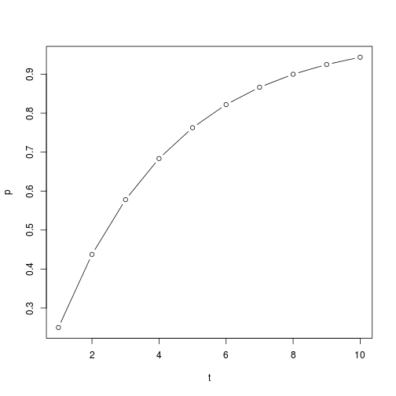

Occupancy Modeling
========================================================
author: Derek Corcoran
date: 2016-03-20
autosize: true

Fitness or abundance patterns
========================================================

- Time consuming
- Hard to replicate
- Almost impossible in rare species
- Need to be able to detect the species
- Species might be there but not detected
- false absences might bias estimates

***

Imperfect detection
========================================================
- Detection is usually not perfect
- Depends on:
  + Species
  + Season
  + Observer
  + Method
  + Weather
  
***

Imperfect detection
========================================================

- Detection is usually not perfect
- Depends on:
  + Species
  + Season
  + Observer
  + Method
  + Weather
  
***

Imperfect detection
========================================================

- Detection is usually not perfect
- Depends on:
  + Species
  + Season
  + Observer
  + Method
  + Weather
  
***

Occupancy modeling
========================================================

- Fraction of habitat occupied by species
- If occupancy 0.4 expected 4 of 10 patches used
- Single season occupancy modeling
- Multiple season occupancy modeling
- Abundance from occupancy modeling
- Occupancy modeling with false positives

***

Two functions
========================================================
 \( p* = 1 -  \left( 1 - p \right)^t \)

 \( \psi = \frac{Sd}{S \times\ p*} \)

***

- Detection probability psi
- Occupancy probability p given presence
- p* probability to detect at least one time in t surveys
- S number of surveyed sites
- Sd number of sites where species is detected

Two functions
========================================================
 \( p* = 1 -  \left( 1 - p \right)^t \)

 \( \psi = \frac{Sd}{S \times\ p*} \)

***

p = 0.25

\( p* = 1 -  \left( 1 - 0.25 \right)^3 \) = 0.578125

S = 100

Sd = 30

\( \psi = \frac{30}{100 \times\ 0.578*} \) = 0.3047619

Probability of detection
========================================================

More repeated sampling p* ~ 1

So you want to do Occupancy modeling
========================================================

- Species detection history
  + eg. 0 1 0
- Detection covariates
  + One measurement for every sampling period
  + must be thought to change detection
  + eg date, observer, detection method, humdity
- Occupancy covariates
  + One measurement per site
  + Stable through all sampling
  + eg Altitude, canopy cover
  
  ***
  
  
  
Assumptions of occupancy modeling
========================================================

- Closure:  No changes in occupancy between surveys
- [No false positives](http://www.srs.fs.usda.gov/pubs/ja/2015/ja_2015_ferguson_001.pdf): detecting a species when it is not present, can occur
through  species  misidentification

***

Package DiversityOccupancy
========================================================

Advantages

- Batch modeling for several species
- Calculate diversity
- Graphical outcomes
- Selecting [priority areas](http://rpubs.com/derek_corcoran/DiversityOccupancy) from Diversity and individual species abundance

***

