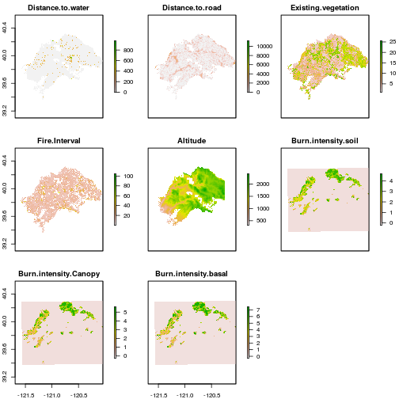
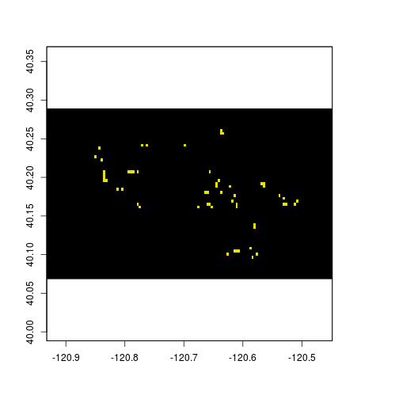

<style>
.small-code pre code {
font-size: 1em;
}
</style>

Occupancy Modeling
========================================================
author: Derek Corcoran
date: 2016-03-23
autosize: true
transition: rotate


Fitness or abundance patterns
========================================================
incremental: true

- Time consuming
- Hard to replicate
- Almost impossible in rare species
- Need to be able to detect the species
- Species might be there but not detected
- false absences might bias estimates


***


Imperfect detection
========================================================
- Detection is usually not perfect
- Depends on:
  + Species
  + Season
  + Observer
  + Method
  + Weather
  
***


Imperfect detection
========================================================

- Detection is usually not perfect
- Depends on:
  + Species
  + Season
  + Observer
  + Method
  + Weather
  
***


Occupancy modeling
========================================================
incremental: true

- Fraction of habitat occupied by species (If occupancy 0.4 expected 4 of 10 patches used)
    + Single season occupancy modeling
    + Multiple season occupancy modeling
    + Abundance from occupancy modeling
    + Occupancy modeling with false positives

***


Two functions
========================================================
 \( p* = 1 -  \left( 1 - p \right)^t \)

 \( \psi = \frac{Sd}{S \times\ p*} \)
 
 
 \( \psi = \frac{exp(Cov \times\ \beta)}{1 + exp(Cov \times\ \beta)} \)


***

- Detection probability psi
- Occupancy probability p given presence
- p* probability to detect at least one time in t surveys
- S number of surveyed sites
- Sd number of sites where species is detected

Two functions
========================================================
 \( p* = 1 -  \left( 1 - p \right)^t \)

 \( \psi = \frac{Sd}{S \times\ p*} \)

***

p = 0.25

\( p* = 1 -  \left( 1 - 0.25 \right)^3 \) = 0.578125

S = 100

Sd = 30

\( \psi = \frac{30}{100 \times\ 0.578*} \) = 0.3047619

Probability of detection
========================================================


More repeated sampling p* ~ 1

So you want to do Occupancy modeling
========================================================
left: 70%
incremental: true

- Species detection history
  + eg. 0 1 0
- Detection covariates
  + One measurement for every sampling period
  + eg date, observer, detection method, humidity
- Occupancy covariates
  + One measurement per site
  + Stable through all sampling (Altitude, canopy cover)
  
  ***
  
  
  
Assumptions of occupancy modeling
========================================================

- Closure:  No changes in occupancy between surveys
- [No false positives](http://www.srs.fs.usda.gov/pubs/ja/2015/ja_2015_ferguson_001.pdf): detecting a species when it is not present, can occur
through  species  misidentification

***


Special cases of occupancy modeling
========================================================

- [Dynamic occupancy modeling](http://www.ncbi.nlm.nih.gov/pmc/articles/PMC3892356/)
- [Occupancy modeling with false positives](https://www.uvm.edu/rsenr/vtcfwru/spreadsheets/occupancy/Occupancy%20Exercises/Exercise12/Royle_Link_2006.pdf)
- [Abundance from occupancy](https://www.uvm.edu/rsenr/vtcfwru/spreadsheets/occupancy/Occupancy%20Exercises/Exercise7/RoyleNichols2003.pdf)

***
Bled et al Ecol Evol. 2013 Dec; 3(15): 4896–4909. 


Literature
========================================================
- [MacKenzie's book](http://www.amazon.com/Occupancy-Estimation-Modeling-Inferring-Occurrence/dp/0120887665)
- [MacKenzie et al 2002 ecology paper](https://www.uvm.edu/rsenr/vtcfwru/spreadsheets/occupancy/Occupancy%20Exercises/Exercise3/MacKenzie%20et%20al.%20single-season.pdf)


***


Niche modeling
========================================================
- Alternative to occupancy
- When detection ~ perfect
- [Almost every algorithm uses pseudoabsenses](https://cran.r-project.org/web/packages/dismo/vignettes/sdm.pdf)

***


Package DiversityOccupancy
========================================================

Advantages

- Batch modeling for several species
- Calculate diversity
- Graphical outcomes
- Selecting [priority areas](http://rpubs.com/derek_corcoran/DiversityOccupancy) from Diversity and individual species abundance

***


Data structure
========================================================
incremental: true

- Pres: A data frame with detection history
- Obscov: A list of data frames with detection covariates
- Sitecov: A data frame with occupancy covariates

***


Detection history
========================================================


```r
BatOccupancy <- read.csv("~/Documents/OccupancyClass/OccupancyClass/Data/BatOccu.csv", row.names=1)
head(BatOccupancy[,1:6], 6)
```

```
  Myyu1 Myyu2 Myyu3 Myca1 Myca2 Myca3
1     0     0     0     0     0     0
2     1     0     0     1     0     0
3     0     0     0     0     1     0
4     0     0     0     0     0     0
5     0     0     0     1     1     1
6     1     0     0     1     1     1
```


Occupancy covariates
========================================================
class: small-code


```r
OccuCov <- read.csv("~/Documents/OccupancyClass/OccupancyClass/Data/OccuCov.csv", row.names=1)
head(OccuCov[,1:3], 6)
```

```
  Distance.to.water Distance.to.road Existing.vegetation
1                 0         325.2647            3.000000
2                 0           0.0000           15.294588
3                 0           0.0000            4.769200
4                 0           0.0000            4.705464
5                 0           0.0000           14.224747
6                 0        2308.6010           15.727460
```

Detection covariates
========================================================
class: small-code


```r
DetCov <- read.csv("~/Documents/OccupancyClass/OccupancyClass/Data/DetCov.csv", row.names=1)
head(DetCov[,1:6], 3)
```

```
    Julian1   Julian2   Julian3    max.hum1  max.hum2 max.hum3
1 -1.683391 -1.683391 -1.683019  0.50559738 1.2023565 1.120956
2 -1.620723 -1.620723 -1.620362  1.06758108 1.2023565 1.120956
3 -1.684443 -1.684443 -1.684071 -0.05638632 0.7919892 1.120956
```

```r
class(DetCov)
```

```
[1] "data.frame"
```

Detection covariates
========================================================


|   Julian1|   Julian2|   Julian3|   max.hum1|   max.hum2|  max.hum3|  max.temp1|  max.temp2|  max.temp3|
|---------:|---------:|---------:|----------:|----------:|---------:|----------:|----------:|----------:|
| -1.683391| -1.683391| -1.683019|  0.5055974|  1.2023565|  1.120956|  1.0693379| -0.0153524| -1.3657181|
| -1.620723| -1.620723| -1.620362|  1.0675811|  1.2023565|  1.120956| -0.6327224| -1.2512231| -0.2918201|
| -1.684443| -1.684443| -1.684071| -0.0563863|  0.7919892|  1.120956|  1.5799560| -0.3684583| -1.3657181|
| -1.557310| -1.557310| -1.556958|  1.0675811| -0.6670948| -1.131374| -1.4837526|  1.2205182|  1.4980099|

- Remember we need our Detection Variables to be a list!!


Detection covariates
========================================================
class: small-code


```r
Julian <- DetCov[,1:3]
MaxHum <- DetCov[,4:6]
MaxTemp<- DetCov[,7:9]
DetCov <- list(Julian, MaxHum, MaxTemp)
str(DetCov)
```

```
List of 3
 $ :'data.frame':	49 obs. of  3 variables:
  ..$ Julian1: num [1:49] -1.68 -1.62 -1.68 -1.56 -1.43 ...
  ..$ Julian2: num [1:49] -1.68 -1.62 -1.68 -1.56 -1.43 ...
  ..$ Julian3: num [1:49] -1.68 -1.62 -1.68 -1.56 -1.43 ...
 $ :'data.frame':	49 obs. of  3 variables:
  ..$ max.hum1: num [1:49] 0.5056 1.0676 -0.0564 1.0676 1.0676 ...
  ..$ max.hum2: num [1:49] 1.202 1.202 0.792 -0.667 1.202 ...
  ..$ max.hum3: num [1:49] 1.12 1.12 1.12 -1.13 1.12 ...
 $ :'data.frame':	49 obs. of  3 variables:
  ..$ max.temp1: num [1:49] 1.069 -0.633 1.58 -1.484 0.899 ...
  ..$ max.temp2: num [1:49] -0.0154 -1.2512 -0.3685 1.2205 0.8674 ...
  ..$ max.temp3: num [1:49] -1.366 -0.292 -1.366 1.498 0.245 ...
```

Detection covariates
========================================================
- R needs to be able to **call** the data frames in our list

```r
names(DetCov)
```

```
NULL
```

```r
names(DetCov) <- c("julian", "maxhum", "maxtemp")
names(DetCov)
```

```
[1] "julian"  "maxhum"  "maxtemp"
```

Occupancy using DiversityOccupancy
========================================================
incremental: true

batchoccu(pres, sitecov, obscov, spp, form)

- **pres**: Detection history data.frame
- **sitecov**: Occupancy covariates data.frame
- **obscov**: Detection covariates List of data.frames *with Names*
- **spp**: the number of species in the pres data.frame
- **form**: formula in the format ~ obscov ~ sitcov 

Remember, we need p to calculate psi (detection before occupancy)

Occupancy using DiversityOccupancy
========================================================
class: small-code


```r
BatOccupancy <-batchoccu(pres = BatOccu, sitecov = sampling.cov, obscov = Dailycov,spp = 17, form = ~ Julian + Meanhum + Meantemp + sdhum + sdtemp ~ Burn.intensity.soil + I(Burn.intensity.soil^2) + Burn.intensity.Canopy + I(Burn.intensity.Canopy^2) + Burn.intensity.basal + I(Burn.intensity.basal^2))
names(BatOccupancy)
```

```
[1] "Covs"   "models" "fit"   
```

```r
summary(BatOccupancy$fit)
```

```
   species.1        species.2        species.3           species.4       
 Min.   :0.0000   Min.   :0.5986   Min.   :0.0000172   Min.   :0.008451  
 1st Qu.:0.2063   1st Qu.:0.5986   1st Qu.:0.0793515   1st Qu.:0.233748  
 Median :0.2063   Median :0.9318   Median :0.0819457   Median :0.326263  
 Mean   :0.4747   Mean   :0.8136   Mean   :0.2416942   Mean   :0.412809  
 3rd Qu.:0.9815   3rd Qu.:1.0000   3rd Qu.:0.3609691   3rd Qu.:0.326263  
 Max.   :1.0000   Max.   :1.0000   Max.   :0.9175235   Max.   :1.000000  
   species.5        species.6          species.7        species.8     
 Min.   :0.1516   Min.   :0.000000   Min.   :0.0000   Min.   :0.6796  
 1st Qu.:0.2312   1st Qu.:0.000000   1st Qu.:0.0000   1st Qu.:0.6796  
 Median :0.2621   Median :0.000000   Median :1.0000   Median :1.0000  
 Mean   :0.4689   Mean   :0.107158   Mean   :0.7144   Mean   :0.8626  
 3rd Qu.:0.8661   3rd Qu.:0.001519   3rd Qu.:1.0000   3rd Qu.:1.0000  
 Max.   :0.9987   Max.   :0.999823   Max.   :1.0000   Max.   :1.0000  
   species.9        species.10       species.11       species.12       
 Min.   :0.0000   Min.   :0.1003   Min.   :0.2048   Min.   :0.0000328  
 1st Qu.:0.0000   1st Qu.:0.3106   1st Qu.:0.4072   1st Qu.:0.1361721  
 Median :0.3026   Median :0.3106   Median :0.4072   Median :0.1361721  
 Mean   :0.3351   Mean   :0.4615   Mean   :0.5099   Mean   :0.3196240  
 3rd Qu.:0.3026   3rd Qu.:0.5953   3rd Qu.:0.6333   3rd Qu.:0.4862649  
 Max.   :1.0000   Max.   :0.9977   Max.   :0.9079   Max.   :0.9984151  
   species.13       species.14         species.15        species.16    
 Min.   :0.6563   Min.   :0.003293   Min.   :0.01588   Min.   :0.0000  
 1st Qu.:0.6563   1st Qu.:0.680732   1st Qu.:0.08033   1st Qu.:0.0000  
 Median :1.0000   Median :0.680732   Median :0.08048   Median :0.1327  
 Mean   :0.8527   Mean   :0.702009   Mean   :0.20998   Mean   :0.2825  
 3rd Qu.:1.0000   3rd Qu.:0.906443   3rd Qu.:0.31015   3rd Qu.:0.1327  
 Max.   :1.0000   Max.   :1.000000   Max.   :0.78746   Max.   :1.0000  
   species.17    
 Min.   :0.0000  
 1st Qu.:0.0000  
 Median :0.0000  
 Mean   :0.2860  
 3rd Qu.:0.9999  
 Max.   :1.0000  
```


Occupancy using DiversityOccupancy
========================================================
class: small-code


```r
BatOccupancy$models[[2]]
```

```

Call:
occu(formula = form, data = models[[i]])

Occupancy:
                           Estimate       SE         z P(>|z|)
(Intercept)                    0.40 4.69e-01  0.851434   0.395
Burn.intensity.soil           95.69 1.35e+04  0.007090   0.994
I(Burn.intensity.soil^2)      12.52 9.69e+03  0.001292   0.999
Burn.intensity.Canopy         50.65 7.51e+03  0.006740   0.995
I(Burn.intensity.Canopy^2)    -7.99 8.03e+03 -0.000996   0.999
Burn.intensity.basal          48.91 9.86e+03  0.004958   0.996
I(Burn.intensity.basal^2)    -19.96 7.24e+02 -0.027573   0.978

Detection:
            Estimate    SE      z P(>|z|)
(Intercept)   0.6266 0.213  2.948  0.0032
Julian        0.0365 0.229  0.159  0.8735
Meanhum      -0.3775 0.253 -1.494  0.1351
Meantemp      0.1632 0.234  0.697  0.4859
sdhum        -0.3506 0.230 -1.523  0.1278
sdtemp        0.1857 0.227  0.820  0.4125

AIC: 201.6127 
```

Plotting Occupancy response
========================================================
class: small-code


```r
responseplot.occu(batch = BatOccupancy, spp = 15, variable = Burn.intensity.soil)
```


- Model, Variable, and Species


Model selection
========================================================
class: small-code


```r
BatOccupancy2 <- batchoccu(pres = BatOccu[,1:9], sitecov = sampling.cov, obscov = Dailycov,spp = 3, form = ~ Meanhum + Meantemp ~  Burn.intensity.basal + I(Burn.intensity.basal^2), dredge = TRUE)
BatOccupancy2$models[[3]]
```

```

Call:
occu(formula = ~1 ~ Burn.intensity.basal + 1, data = data2)

Occupancy:
                     Estimate    SE     z P(>|z|)
(Intercept)            -2.098 0.605 -3.47 0.00052
Burn.intensity.basal    0.401 0.157  2.56 0.01041

Detection:
 Estimate    SE   z P(>|z|)
   0.0424 0.422 0.1    0.92

AIC: 93.19072 
```

Predictions
========================================================
class: small-code

Again we can do see at individual variables:


```r
responseplot.occu(batch = BatOccupancy2, spp = 3, variable = Burn.intensity.basal)
```



Predictions
========================================================
class: small-code

What if we have spatial data


```r
library(raster)
plot(plumas.stack)
```


***
lets make it smaller

```r
e <- extent(-120.9305, -120.4498, 40.06769, 40.29006)
little.plumas <- stack(crop(plumas.stack, e))
plot(little.plumas)
```


Predictions
========================================================
class: small-code


```r
Occupancy.stack <- occupancy.predict(batch = BatOccupancy2, new.data =
little.plumas)
```

```
  doing row 1000 of 7366 
  doing row 2000 of 7366 
  doing row 3000 of 7366 
  doing row 4000 of 7366 
  doing row 5000 of 7366 
  doing row 6000 of 7366 
  doing row 7000 of 7366 
  doing row 1000 of 7366 
  doing row 2000 of 7366 
  doing row 3000 of 7366 
  doing row 4000 of 7366 
  doing row 5000 of 7366 
  doing row 6000 of 7366 
  doing row 7000 of 7366 
  doing row 1000 of 7366 
  doing row 2000 of 7366 
  doing row 3000 of 7366 
  doing row 4000 of 7366 
  doing row 5000 of 7366 
  doing row 6000 of 7366 
  doing row 7000 of 7366 
```

***


```r
plot(Occupancy.stack)
```


Abundance and diversity using DiversityOccupancy
========================================================
class: small-code


```r
BatAbundance <-diversityoccu(pres = BatOccu, sitecov = sampling.cov, obscov = Dailycov, spp = 17, form = ~ Julian + Meanhum + Meantemp + sdhum + sdtemp ~ Burn.intensity.soil + I(Burn.intensity.soil^2) + Burn.intensity.Canopy + I(Burn.intensity.Canopy^2) + Burn.intensity.basal + I(Burn.intensity.basal^2))
names(BatAbundance)
```

```
[1] "Covs"      "models"    "Diversity" "species"  
```


```r
summary(BatAbundance$species)
```

```
       h            species.1         species.2       species.3       
 Min.   :0.7306   Min.   : 0.1821   Min.   :1.073   Min.   :0.000542  
 1st Qu.:1.2688   1st Qu.: 0.4731   1st Qu.:1.073   1st Qu.:0.085348  
 Median :1.2688   Median : 0.6350   Median :1.325   Median :0.091487  
 Mean   :1.3168   Mean   : 1.7536   Mean   :2.087   Mean   :0.333119  
 3rd Qu.:1.4404   3rd Qu.: 1.4990   3rd Qu.:2.708   3rd Qu.:0.408665  
 Max.   :1.6776   Max.   :19.1502   Max.   :9.461   Max.   :1.476396  
   species.4           species.5         species.6        
 Min.   : 0.000038   Min.   : 0.2464   Min.   : 0.000000  
 1st Qu.: 1.343394   1st Qu.: 0.2899   1st Qu.: 0.000000  
 Median : 1.721218   Median : 0.2952   Median : 0.000000  
 Mean   : 2.397644   Mean   : 1.0541   Mean   : 0.737486  
 3rd Qu.: 2.015600   3rd Qu.: 1.4820   3rd Qu.: 0.008663  
 Max.   :17.789285   Max.   :10.6545   Max.   :16.441510  
```


========================================================
class: small-code

responseplot is a ggplot object easy to [modify](http://zevross.com/blog/2014/08/04/beautiful-plotting-in-r-a-ggplot2-cheatsheet-3/)

```r
responseplot.abund(BatAbundance, spp = 1, variable = Burn.intensity.Canopy)
```


***


```r
library(ggplot2)
K <- responseplot.abund(BatAbundance, spp = 1, variable = Burn.intensity.Canopy)
K + geom_line(color = "red") + theme_dark()
```


Modeling diversity from abundance
========================================================
class: small-code


```r
glm.diversity <- model.diversity(BatAbundance, method = "g")
```

```
Initialization...
TASK: Genetic algorithm in the candidate set.
Initialization...
Algorithm started...

After 10 generations:
Best model: Diversity~1+Existing.vegetation+Burn.intensity.soil+Burn.intensity.Canopy
Crit= -54.1378219271883
Mean crit= -21.6273234470374
Change in best IC: -10054.1378219272 / Change in mean IC: -10021.627323447

After 20 generations:
Best model: Diversity~1+Existing.vegetation+Burn.intensity.soil+Burn.intensity.Canopy
Crit= -54.1378219271883
Mean crit= -21.7838002776434
Change in best IC: 0 / Change in mean IC: -0.156476830606021

After 30 generations:
Best model: Diversity~1+Existing.vegetation+Burn.intensity.soil+Burn.intensity.Canopy
Crit= -54.1378219271883
Mean crit= -23.8990107892228
Change in best IC: 0 / Change in mean IC: -2.11521051157932

After 40 generations:
Best model: Diversity~1+Existing.vegetation+Burn.intensity.soil+Burn.intensity.Canopy
Crit= -54.1378219271883
Mean crit= -26.245211505578
Change in best IC: 0 / Change in mean IC: -2.3462007163552

After 50 generations:
Best model: Diversity~1+Existing.vegetation+Burn.intensity.soil+Burn.intensity.Canopy
Crit= -54.1378219271883
Mean crit= -28.114358753057
Change in best IC: 0 / Change in mean IC: -1.86914724747907

After 60 generations:
Best model: Diversity~1+Existing.vegetation+Burn.intensity.soil+Burn.intensity.Canopy
Crit= -54.1378219271883
Mean crit= -29.4565844685044
Change in best IC: 0 / Change in mean IC: -1.34222571544737

After 70 generations:
Best model: Diversity~1+Existing.vegetation+Burn.intensity.soil+Burn.intensity.Canopy
Crit= -54.1378219271883
Mean crit= -31.9658134699832
Change in best IC: 0 / Change in mean IC: -2.50922900147881

After 80 generations:
Best model: Diversity~1+Existing.vegetation+Burn.intensity.soil+Burn.intensity.Canopy
Crit= -54.1378219271883
Mean crit= -33.2457351435495
Change in best IC: 0 / Change in mean IC: -1.27992167356625

After 90 generations:
Best model: Diversity~1+Existing.vegetation+Burn.intensity.soil+Burn.intensity.Canopy
Crit= -54.1378219271883
Mean crit= -35.8256614788247
Change in best IC: 0 / Change in mean IC: -2.57992633527521

After 100 generations:
Best model: Diversity~1+Existing.vegetation+Burn.intensity.soil+Burn.intensity.Canopy
Crit= -54.1378219271883
Mean crit= -36.6473671066928
Change in best IC: 0 / Change in mean IC: -0.821705627868113

After 110 generations:
Best model: Diversity~1+Existing.vegetation+Burn.intensity.soil+Burn.intensity.Canopy
Crit= -54.1378219271883
Mean crit= -38.3006372483668
Change in best IC: 0 / Change in mean IC: -1.65327014167404

After 120 generations:
Best model: Diversity~1+Existing.vegetation+Burn.intensity.soil+Burn.intensity.Canopy
Crit= -54.1378219271883
Mean crit= -39.1330931816643
Change in best IC: 0 / Change in mean IC: -0.832455933297496

After 130 generations:
Best model: Diversity~1+Existing.vegetation+Burn.intensity.soil+Burn.intensity.Canopy
Crit= -54.1378219271883
Mean crit= -41.6093083927287
Change in best IC: 0 / Change in mean IC: -2.47621521106439

After 140 generations:
Best model: Diversity~1+Existing.vegetation+Burn.intensity.soil+Burn.intensity.Canopy
Crit= -54.1378219271883
Mean crit= -42.4128634938775
Change in best IC: 0 / Change in mean IC: -0.803555101148767

After 150 generations:
Best model: Diversity~1+Existing.vegetation+Burn.intensity.soil+Burn.intensity.Canopy
Crit= -54.1378219271883
Mean crit= -43.1680803462903
Change in best IC: 0 / Change in mean IC: -0.755216852412758

After 160 generations:
Best model: Diversity~1+Existing.vegetation+Burn.intensity.soil+Burn.intensity.Canopy
Crit= -54.1378219271883
Mean crit= -43.9842819268033
Change in best IC: 0 / Change in mean IC: -0.816201580513045

After 170 generations:
Best model: Diversity~1+Existing.vegetation+Burn.intensity.soil+Burn.intensity.Canopy
Crit= -54.1378219271883
Mean crit= -43.9842819268033
Change in best IC: 0 / Change in mean IC: 0

After 180 generations:
Best model: Diversity~1+Existing.vegetation+Burn.intensity.soil+Burn.intensity.Canopy
Crit= -54.1378219271883
Mean crit= -43.9868637312418
Change in best IC: 0 / Change in mean IC: -0.00258180443845646

After 190 generations:
Best model: Diversity~1+Existing.vegetation+Burn.intensity.soil+Burn.intensity.Canopy
Crit= -54.1378219271883
Mean crit= -44.4113360813296
Change in best IC: 0 / Change in mean IC: -0.424472350087846

After 200 generations:
Best model: Diversity~1+Existing.vegetation+Burn.intensity.soil+Burn.intensity.Canopy
Crit= -54.1378219271883
Mean crit= -44.7865502489356
Change in best IC: 0 / Change in mean IC: -0.375214167606018

After 210 generations:
Best model: Diversity~1+Existing.vegetation+Burn.intensity.soil+Burn.intensity.Canopy
Crit= -54.1378219271883
Mean crit= -45.1357660260762
Change in best IC: 0 / Change in mean IC: -0.34921577714055

After 220 generations:
Best model: Diversity~1+Existing.vegetation+Burn.intensity.soil+Burn.intensity.Canopy
Crit= -54.1378219271883
Mean crit= -45.1357660260762
Change in best IC: 0 / Change in mean IC: 0

After 230 generations:
Best model: Diversity~1+Existing.vegetation+Burn.intensity.soil+Burn.intensity.Canopy
Crit= -54.1378219271883
Mean crit= -45.1357660260762
Change in best IC: 0 / Change in mean IC: 0

After 240 generations:
Best model: Diversity~1+Existing.vegetation+Burn.intensity.soil+Burn.intensity.Canopy
Crit= -54.1378219271883
Mean crit= -45.1372698586277
Change in best IC: 0 / Change in mean IC: -0.00150383255152775

After 250 generations:
Best model: Diversity~1+Existing.vegetation+Burn.intensity.soil+Burn.intensity.Canopy
Crit= -54.1378219271883
Mean crit= -45.1382023376441
Change in best IC: 0 / Change in mean IC: -0.000932479016384491

After 260 generations:
Best model: Diversity~1+Existing.vegetation+Burn.intensity.soil+Burn.intensity.Canopy
Crit= -54.1378219271883
Mean crit= -45.1382023376441
Improvements in best and average IC have bebingo en below the specified goals.
Algorithm is declared to have converged.
Completed.
```

Modeling diversity from abundance
========================================================
class: small-code


```r
kable(glm.diversity$Table)
```


|model                                                                                                |      aicc|   weights| Delta.AICc|
|:----------------------------------------------------------------------------------------------------|---------:|---------:|----------:|
|Diversity ~ 1 + Existing.vegetation + Burn.intensity.soil + Burn.intensity.Canopy                    | -54.13782| 0.4985534|   0.000000|
|Diversity ~ 1 + Existing.vegetation + Altitude + Burn.intensity.soil + Burn.intensity.Canopy         | -52.96446| 0.2772807|   1.173361|
|Diversity ~ 1 + Distance.to.road + Existing.vegetation + Burn.intensity.soil + Burn.intensity.Canopy | -52.53917| 0.2241658|   1.598649|

```r
glm.diversity$Best_model
```

```
Diversity ~ 1 + Existing.vegetation + Burn.intensity.soil + Burn.intensity.Canopy
<environment: 0x8f9d358>
```

Modeling diversity from abundance
========================================================
class: small-code


```r
responseplot.diver(glm.diversity, variable = Burn.intensity.Canopy)
```



Selecting conservation areas based on diversity and abundance
========================================================
class: small-code
[Full tutorial](http://rpubs.com/derek_corcoran/DiversityOccupancy)

```r
Selected.area <- diversity.predict(model = BatAbundance, diverse = glm.diversity,
new.data = little.plumas, quantile.nth = 0.85, species =
c(TRUE, TRUE, FALSE, FALSE, FALSE, FALSE, FALSE, FALSE, FALSE, FALSE, FALSE,
FALSE, FALSE, FALSE, FALSE,FALSE,FALSE))
```

```
  doing row 1000 of 7366 
  doing row 2000 of 7366 
  doing row 3000 of 7366 
  doing row 4000 of 7366 
  doing row 5000 of 7366 
  doing row 6000 of 7366 
  doing row 7000 of 7366 
  doing row 1000 of 7366 
  doing row 2000 of 7366 
  doing row 3000 of 7366 
  doing row 4000 of 7366 
  doing row 5000 of 7366 
  doing row 6000 of 7366 
  doing row 7000 of 7366 
```


Selecting conservation areas
========================================================
class: small-code


```r
names(Selected.area)
```

```
[1] "species"          "diversity.raster" "priority.area"   
```

```r
plot(Selected.area$priority.area, colNA = "black")
```


Selecting conservation areas
========================================================
class: small-code


```r
plot(Selected.area$diversity.raster, colNA = "black")
```


***


```r
plot(Selected.area$species, colNA = "black")
```


Package unmarked
========================================================

Advantages

- Finer control
- Modeling with false positives
- Dynamic occupancy modeling

Cons

- More work to use data
- No Diversity modeling
- No graphical output
- No automatica model selection

***


