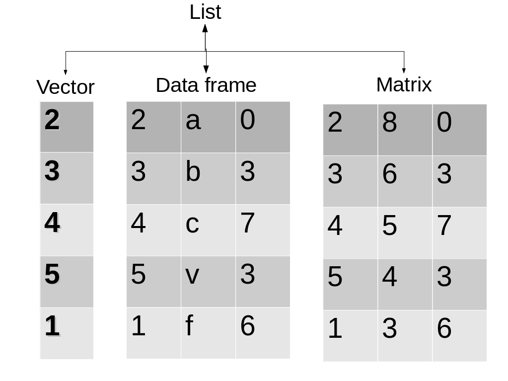

<style>
.small-code pre code {
font-size: 1em;
}
</style>

Occupancy Modeling
========================================================
author: Derek Corcoran
date: 2016-03-22
autosize: true
transition: rotate


Fitness or abundance patterns
========================================================
incremental: true

- Time consuming
- Hard to replicate
- Almost impossible in rare species
- Need to be able to detect the species
- Species might be there but not detected
- false absences might bias estimates


***


Imperfect detection
========================================================
- Detection is usually not perfect
- Depends on:
  + Species
  + Season
  + Observer
  + Method
  + Weather
  
***


Imperfect detection
========================================================

- Detection is usually not perfect
- Depends on:
  + Species
  + Season
  + Observer
  + Method
  + Weather
  
***


Occupancy modeling
========================================================
incremental: true

- Fraction of habitat occupied by species (If occupancy 0.4 expected 4 of 10 patches used)
    + Single season occupancy modeling
    + Multiple season occupancy modeling
    + Abundance from occupancy modeling
    + Occupancy modeling with false positives

***


Two functions
========================================================
 \( p* = 1 -  \left( 1 - p \right)^t \)

 \( \psi = \frac{Sd}{S \times\ p*} \)

***

- Detection probability psi
- Occupancy probability p given presence
- p* probability to detect at least one time in t surveys
- S number of surveyed sites
- Sd number of sites where species is detected

Two functions
========================================================
 \( p* = 1 -  \left( 1 - p \right)^t \)

 \( \psi = \frac{Sd}{S \times\ p*} \)

***

p = 0.25

\( p* = 1 -  \left( 1 - 0.25 \right)^3 \) = 0.578125

S = 100

Sd = 30

\( \psi = \frac{30}{100 \times\ 0.578*} \) = 0.3047619

Probability of detection
========================================================


More repeated sampling p* ~ 1

So you want to do Occupancy modeling
========================================================
left: 70%
incremental: true

- Species detection history
  + eg. 0 1 0
- Detection covariates
  + One measurement for every sampling period
  + eg date, observer, detection method, humidity
- Occupancy covariates
  + One measurement per site
  + Stable through all sampling (Altitude, canopy cover)
  
  ***
  
  
  
Assumptions of occupancy modeling
========================================================

- Closure:  No changes in occupancy between surveys
- [No false positives](http://www.srs.fs.usda.gov/pubs/ja/2015/ja_2015_ferguson_001.pdf): detecting a species when it is not present, can occur
through  species  misidentification

***


Package DiversityOccupancy
========================================================

Advantages

- Batch modeling for several species
- Calculate diversity
- Graphical outcomes
- Selecting [priority areas](http://rpubs.com/derek_corcoran/DiversityOccupancy) from Diversity and individual species abundance

***


Data structure
========================================================
incremental: true

- Pres: A data frame with detection history
- Obscov: A list of data frames with detection covariates
- Sitecov: A data frame with occupancy covariates

***




Detection history
========================================================


```r
BatOccupancy <- read.csv("~/Documents/OccupancyClass/OccupancyClass/Data/BatOccu.csv", row.names=1)
head(BatOccupancy[,1:6], 6)
```

```
  Myyu1 Myyu2 Myyu3 Myca1 Myca2 Myca3
1     0     0     0     0     0     0
2     1     0     0     1     0     0
3     0     0     0     0     1     0
4     0     0     0     0     0     0
5     0     0     0     1     1     1
6     1     0     0     1     1     1
```


Occupancy covariates
========================================================
class: small-code


```r
OccuCov <- read.csv("~/Documents/OccupancyClass/OccupancyClass/Data/OccuCov.csv", row.names=1)
head(OccuCov[,1:3], 6)
```

```
  Distance.to.water Distance.to.road Existing.vegetation
1                 0         325.2647            3.000000
2                 0           0.0000           15.294588
3                 0           0.0000            4.769200
4                 0           0.0000            4.705464
5                 0           0.0000           14.224747
6                 0        2308.6010           15.727460
```

Detection covariates
========================================================
class: small-code


```r
DetCov <- read.csv("~/Documents/OccupancyClass/OccupancyClass/Data/DetCov.csv", row.names=1)
head(DetCov[,1:6], 3)
```

```
    Julian1   Julian2   Julian3    max.hum1  max.hum2 max.hum3
1 -1.683391 -1.683391 -1.683019  0.50559738 1.2023565 1.120956
2 -1.620723 -1.620723 -1.620362  1.06758108 1.2023565 1.120956
3 -1.684443 -1.684443 -1.684071 -0.05638632 0.7919892 1.120956
```

```r
class(DetCov)
```

```
[1] "data.frame"
```

Detection covariates
========================================================


|   Julian1|   Julian2|   Julian3|   max.hum1|   max.hum2|  max.hum3|  max.temp1|  max.temp2|  max.temp3|
|---------:|---------:|---------:|----------:|----------:|---------:|----------:|----------:|----------:|
| -1.683391| -1.683391| -1.683019|  0.5055974|  1.2023565|  1.120956|  1.0693379| -0.0153524| -1.3657181|
| -1.620723| -1.620723| -1.620362|  1.0675811|  1.2023565|  1.120956| -0.6327224| -1.2512231| -0.2918201|
| -1.684443| -1.684443| -1.684071| -0.0563863|  0.7919892|  1.120956|  1.5799560| -0.3684583| -1.3657181|
| -1.557310| -1.557310| -1.556958|  1.0675811| -0.6670948| -1.131374| -1.4837526|  1.2205182|  1.4980099|

- Remember we need our Detection Variables to be a list!!


Detection covariates
========================================================
class: small-code


```r
Julian <- DetCov[,1:3]
MaxHum <- DetCov[,4:6]
MaxTemp<- DetCov[,7:9]
DetCov <- list(Julian, MaxHum, MaxTemp)
str(DetCov)
```

```
List of 3
 $ :'data.frame':	49 obs. of  3 variables:
  ..$ Julian1: num [1:49] -1.68 -1.62 -1.68 -1.56 -1.43 ...
  ..$ Julian2: num [1:49] -1.68 -1.62 -1.68 -1.56 -1.43 ...
  ..$ Julian3: num [1:49] -1.68 -1.62 -1.68 -1.56 -1.43 ...
 $ :'data.frame':	49 obs. of  3 variables:
  ..$ max.hum1: num [1:49] 0.5056 1.0676 -0.0564 1.0676 1.0676 ...
  ..$ max.hum2: num [1:49] 1.202 1.202 0.792 -0.667 1.202 ...
  ..$ max.hum3: num [1:49] 1.12 1.12 1.12 -1.13 1.12 ...
 $ :'data.frame':	49 obs. of  3 variables:
  ..$ max.temp1: num [1:49] 1.069 -0.633 1.58 -1.484 0.899 ...
  ..$ max.temp2: num [1:49] -0.0154 -1.2512 -0.3685 1.2205 0.8674 ...
  ..$ max.temp3: num [1:49] -1.366 -0.292 -1.366 1.498 0.245 ...
```

Detection covariates
========================================================
- R needs to be able to **call** the data frames in our list

```r
names(DetCov)
```

```
NULL
```

```r
names(DetCov) <- c("julian", "maxhum", "maxtemp")
names(DetCov)
```

```
[1] "julian"  "maxhum"  "maxtemp"
```

Modeling using DiversityOccupancy
========================================================
incremental: true

batchoccu(pres, sitecov, obscov, spp, form)

- **pres**: Detection history data.frame
- **sitecov**: Occupancy covariates data.frame
- **obscov**: Detection covariates List of data.frames *with Names*
- **spp**: the number of species in the pres data.frame
- **form**: formula in the format ~ obscov ~ sitcov 

Remember, we need p to calculate psi (detection before occupancy)

Modeling using DiversityOccupancy
========================================================
class: small-code


```r
BatOccupancy <-batchoccu(pres = BatOccu, sitecov = sampling.cov, obscov = Dailycov,spp = 17, form = ~ Julian + Meanhum + Meantemp + sdhum + sdtemp ~ Burn.intensity.soil + I(Burn.intensity.soil^2) + Burn.intensity.Canopy + I(Burn.intensity.Canopy^2) + Burn.intensity.basal + I(Burn.intensity.basal^2))
names(BatOccupancy)
```

```
[1] "Covs"   "models" "fit"   
```

```r
summary(BatOccupancy$fit)
```

```
   species.1        species.2        species.3           species.4       
 Min.   :0.0000   Min.   :0.5986   Min.   :0.0000172   Min.   :0.008451  
 1st Qu.:0.2063   1st Qu.:0.5986   1st Qu.:0.0793515   1st Qu.:0.233748  
 Median :0.2063   Median :0.9318   Median :0.0819457   Median :0.326263  
 Mean   :0.4747   Mean   :0.8136   Mean   :0.2416942   Mean   :0.412809  
 3rd Qu.:0.9815   3rd Qu.:1.0000   3rd Qu.:0.3609691   3rd Qu.:0.326263  
 Max.   :1.0000   Max.   :1.0000   Max.   :0.9175235   Max.   :1.000000  
   species.5        species.6          species.7        species.8     
 Min.   :0.1516   Min.   :0.000000   Min.   :0.0000   Min.   :0.6796  
 1st Qu.:0.2312   1st Qu.:0.000000   1st Qu.:0.0000   1st Qu.:0.6796  
 Median :0.2621   Median :0.000000   Median :1.0000   Median :1.0000  
 Mean   :0.4689   Mean   :0.107158   Mean   :0.7144   Mean   :0.8626  
 3rd Qu.:0.8661   3rd Qu.:0.001519   3rd Qu.:1.0000   3rd Qu.:1.0000  
 Max.   :0.9987   Max.   :0.999823   Max.   :1.0000   Max.   :1.0000  
   species.9        species.10       species.11       species.12       
 Min.   :0.0000   Min.   :0.1003   Min.   :0.2048   Min.   :0.0000328  
 1st Qu.:0.0000   1st Qu.:0.3106   1st Qu.:0.4072   1st Qu.:0.1361721  
 Median :0.3026   Median :0.3106   Median :0.4072   Median :0.1361721  
 Mean   :0.3351   Mean   :0.4615   Mean   :0.5099   Mean   :0.3196240  
 3rd Qu.:0.3026   3rd Qu.:0.5953   3rd Qu.:0.6333   3rd Qu.:0.4862649  
 Max.   :1.0000   Max.   :0.9977   Max.   :0.9079   Max.   :0.9984151  
   species.13       species.14         species.15        species.16    
 Min.   :0.6563   Min.   :0.003293   Min.   :0.01588   Min.   :0.0000  
 1st Qu.:0.6563   1st Qu.:0.680732   1st Qu.:0.08033   1st Qu.:0.0000  
 Median :1.0000   Median :0.680732   Median :0.08048   Median :0.1327  
 Mean   :0.8527   Mean   :0.702009   Mean   :0.20998   Mean   :0.2825  
 3rd Qu.:1.0000   3rd Qu.:0.906443   3rd Qu.:0.31015   3rd Qu.:0.1327  
 Max.   :1.0000   Max.   :1.000000   Max.   :0.78746   Max.   :1.0000  
   species.17    
 Min.   :0.0000  
 1st Qu.:0.0000  
 Median :0.0000  
 Mean   :0.2860  
 3rd Qu.:0.9999  
 Max.   :1.0000  
```


Modeling using DiversityOccupancy
========================================================
class: small-code


```r
BatOccupancy$models[[2]]
```

```

Call:
occu(formula = form, data = models[[i]])

Occupancy:
                           Estimate       SE         z P(>|z|)
(Intercept)                    0.40 4.69e-01  0.851434   0.395
Burn.intensity.soil           95.69 1.35e+04  0.007090   0.994
I(Burn.intensity.soil^2)      12.52 9.69e+03  0.001292   0.999
Burn.intensity.Canopy         50.65 7.51e+03  0.006740   0.995
I(Burn.intensity.Canopy^2)    -7.99 8.03e+03 -0.000996   0.999
Burn.intensity.basal          48.91 9.86e+03  0.004958   0.996
I(Burn.intensity.basal^2)    -19.96 7.24e+02 -0.027573   0.978

Detection:
            Estimate    SE      z P(>|z|)
(Intercept)   0.6266 0.213  2.948  0.0032
Julian        0.0365 0.229  0.159  0.8735
Meanhum      -0.3775 0.253 -1.494  0.1351
Meantemp      0.1632 0.234  0.697  0.4859
sdhum        -0.3506 0.230 -1.523  0.1278
sdtemp        0.1857 0.227  0.820  0.4125

AIC: 201.6127 
```

Plotting Occupancy response
========================================================
class: small-code


```r
responseplot.occu(batch = BatOccupancy, spp = 15, variable = Burn.intensity.soil)
```


***

- Model, Variable, and Species
- responseplot.occu(batch = BatOccupancy, spp = 15, variable = Burn.intensity.soil)


Model selection
========================================================
class: small-code


```r
BatOccupancy2 <- batchoccu(pres = BatOccu[,1:9], sitecov = sampling.cov, obscov = Dailycov,spp = 3, form = ~ Meanhum + Meantemp ~  Burn.intensity.basal + I(Burn.intensity.basal^2), dredge = TRUE)
BatOccupancy2$models[[3]]
```

```

Call:
occu(formula = ~1 ~ Burn.intensity.basal + 1, data = data2)

Occupancy:
                     Estimate    SE     z P(>|z|)
(Intercept)            -2.098 0.605 -3.47 0.00052
Burn.intensity.basal    0.401 0.157  2.56 0.01041

Detection:
 Estimate    SE   z P(>|z|)
   0.0424 0.422 0.1    0.92

AIC: 93.19072 
```

Predictions
========================================================
class: small-code

Again we can do see at individual variables:


```r
responseplot.occu(batch = BatOccupancy2, spp = 3, variable = Burn.intensity.basal)
```


Predictions
========================================================
class: small-code

What if we have spatial data


```r
library(raster)
plot(plumas.stack)
```


***


```r
Occupancy.stack <- occupancy.predict(batch = BatOccupancy2, new.data =
plumas.stack)
```

```
  doing row 1000 of 108500 
  doing row 2000 of 108500 
  doing row 3000 of 108500 
  doing row 4000 of 108500 
  doing row 5000 of 108500 
  doing row 6000 of 108500 
  doing row 7000 of 108500 
  doing row 8000 of 108500 
  doing row 9000 of 108500 
  doing row 10000 of 108500 
  doing row 11000 of 108500 
  doing row 12000 of 108500 
  doing row 13000 of 108500 
  doing row 14000 of 108500 
  doing row 15000 of 108500 
  doing row 16000 of 108500 
  doing row 17000 of 108500 
  doing row 18000 of 108500 
  doing row 19000 of 108500 
  doing row 20000 of 108500 
  doing row 21000 of 108500 
  doing row 22000 of 108500 
  doing row 23000 of 108500 
  doing row 24000 of 108500 
  doing row 25000 of 108500 
  doing row 26000 of 108500 
  doing row 27000 of 108500 
  doing row 28000 of 108500 
  doing row 29000 of 108500 
  doing row 30000 of 108500 
  doing row 31000 of 108500 
  doing row 32000 of 108500 
  doing row 33000 of 108500 
  doing row 34000 of 108500 
  doing row 35000 of 108500 
  doing row 36000 of 108500 
  doing row 37000 of 108500 
  doing row 38000 of 108500 
  doing row 39000 of 108500 
  doing row 40000 of 108500 
  doing row 41000 of 108500 
  doing row 42000 of 108500 
  doing row 43000 of 108500 
  doing row 44000 of 108500 
  doing row 45000 of 108500 
  doing row 46000 of 108500 
  doing row 47000 of 108500 
  doing row 48000 of 108500 
  doing row 49000 of 108500 
  doing row 50000 of 108500 
  doing row 51000 of 108500 
  doing row 52000 of 108500 
  doing row 53000 of 108500 
  doing row 54000 of 108500 
  doing row 55000 of 108500 
  doing row 56000 of 108500 
  doing row 57000 of 108500 
  doing row 58000 of 108500 
  doing row 59000 of 108500 
  doing row 60000 of 108500 
  doing row 61000 of 108500 
  doing row 62000 of 108500 
  doing row 63000 of 108500 
  doing row 64000 of 108500 
  doing row 65000 of 108500 
  doing row 66000 of 108500 
  doing row 67000 of 108500 
  doing row 68000 of 108500 
  doing row 69000 of 108500 
  doing row 70000 of 108500 
  doing row 71000 of 108500 
  doing row 72000 of 108500 
  doing row 73000 of 108500 
  doing row 74000 of 108500 
  doing row 75000 of 108500 
  doing row 76000 of 108500 
  doing row 77000 of 108500 
  doing row 78000 of 108500 
  doing row 79000 of 108500 
  doing row 80000 of 108500 
  doing row 81000 of 108500 
  doing row 82000 of 108500 
  doing row 83000 of 108500 
  doing row 84000 of 108500 
  doing row 85000 of 108500 
  doing row 86000 of 108500 
  doing row 87000 of 108500 
  doing row 88000 of 108500 
  doing row 89000 of 108500 
  doing row 90000 of 108500 
  doing row 91000 of 108500 
  doing row 92000 of 108500 
  doing row 93000 of 108500 
  doing row 94000 of 108500 
  doing row 95000 of 108500 
  doing row 96000 of 108500 
  doing row 97000 of 108500 
  doing row 98000 of 108500 
  doing row 99000 of 108500 
  doing row 100000 of 108500 
  doing row 101000 of 108500 
  doing row 102000 of 108500 
  doing row 103000 of 108500 
  doing row 104000 of 108500 
  doing row 105000 of 108500 
  doing row 106000 of 108500 
  doing row 107000 of 108500 
  doing row 108000 of 108500 
  doing row 1000 of 108500 
  doing row 2000 of 108500 
  doing row 3000 of 108500 
  doing row 4000 of 108500 
  doing row 5000 of 108500 
  doing row 6000 of 108500 
  doing row 7000 of 108500 
  doing row 8000 of 108500 
  doing row 9000 of 108500 
  doing row 10000 of 108500 
  doing row 11000 of 108500 
  doing row 12000 of 108500 
  doing row 13000 of 108500 
  doing row 14000 of 108500 
  doing row 15000 of 108500 
  doing row 16000 of 108500 
  doing row 17000 of 108500 
  doing row 18000 of 108500 
  doing row 19000 of 108500 
  doing row 20000 of 108500 
  doing row 21000 of 108500 
  doing row 22000 of 108500 
  doing row 23000 of 108500 
  doing row 24000 of 108500 
  doing row 25000 of 108500 
  doing row 26000 of 108500 
  doing row 27000 of 108500 
  doing row 28000 of 108500 
  doing row 29000 of 108500 
  doing row 30000 of 108500 
  doing row 31000 of 108500 
  doing row 32000 of 108500 
  doing row 33000 of 108500 
  doing row 34000 of 108500 
  doing row 35000 of 108500 
  doing row 36000 of 108500 
  doing row 37000 of 108500 
  doing row 38000 of 108500 
  doing row 39000 of 108500 
  doing row 40000 of 108500 
  doing row 41000 of 108500 
  doing row 42000 of 108500 
  doing row 43000 of 108500 
  doing row 44000 of 108500 
  doing row 45000 of 108500 
  doing row 46000 of 108500 
  doing row 47000 of 108500 
  doing row 48000 of 108500 
  doing row 49000 of 108500 
  doing row 50000 of 108500 
  doing row 51000 of 108500 
  doing row 52000 of 108500 
  doing row 53000 of 108500 
  doing row 54000 of 108500 
  doing row 55000 of 108500 
  doing row 56000 of 108500 
  doing row 57000 of 108500 
  doing row 58000 of 108500 
  doing row 59000 of 108500 
  doing row 60000 of 108500 
  doing row 61000 of 108500 
  doing row 62000 of 108500 
  doing row 63000 of 108500 
  doing row 64000 of 108500 
  doing row 65000 of 108500 
  doing row 66000 of 108500 
  doing row 67000 of 108500 
  doing row 68000 of 108500 
  doing row 69000 of 108500 
  doing row 70000 of 108500 
  doing row 71000 of 108500 
  doing row 72000 of 108500 
  doing row 73000 of 108500 
  doing row 74000 of 108500 
  doing row 75000 of 108500 
  doing row 76000 of 108500 
  doing row 77000 of 108500 
  doing row 78000 of 108500 
  doing row 79000 of 108500 
  doing row 80000 of 108500 
  doing row 81000 of 108500 
  doing row 82000 of 108500 
  doing row 83000 of 108500 
  doing row 84000 of 108500 
  doing row 85000 of 108500 
  doing row 86000 of 108500 
  doing row 87000 of 108500 
  doing row 88000 of 108500 
  doing row 89000 of 108500 
  doing row 90000 of 108500 
  doing row 91000 of 108500 
  doing row 92000 of 108500 
  doing row 93000 of 108500 
  doing row 94000 of 108500 
  doing row 95000 of 108500 
  doing row 96000 of 108500 
  doing row 97000 of 108500 
  doing row 98000 of 108500 
  doing row 99000 of 108500 
  doing row 100000 of 108500 
  doing row 101000 of 108500 
  doing row 102000 of 108500 
  doing row 103000 of 108500 
  doing row 104000 of 108500 
  doing row 105000 of 108500 
  doing row 106000 of 108500 
  doing row 107000 of 108500 
  doing row 108000 of 108500 
  doing row 1000 of 108500 
  doing row 2000 of 108500 
  doing row 3000 of 108500 
  doing row 4000 of 108500 
  doing row 5000 of 108500 
  doing row 6000 of 108500 
  doing row 7000 of 108500 
  doing row 8000 of 108500 
  doing row 9000 of 108500 
  doing row 10000 of 108500 
  doing row 11000 of 108500 
  doing row 12000 of 108500 
  doing row 13000 of 108500 
  doing row 14000 of 108500 
  doing row 15000 of 108500 
  doing row 16000 of 108500 
  doing row 17000 of 108500 
  doing row 18000 of 108500 
  doing row 19000 of 108500 
  doing row 20000 of 108500 
  doing row 21000 of 108500 
  doing row 22000 of 108500 
  doing row 23000 of 108500 
  doing row 24000 of 108500 
  doing row 25000 of 108500 
  doing row 26000 of 108500 
  doing row 27000 of 108500 
  doing row 28000 of 108500 
  doing row 29000 of 108500 
  doing row 30000 of 108500 
  doing row 31000 of 108500 
  doing row 32000 of 108500 
  doing row 33000 of 108500 
  doing row 34000 of 108500 
  doing row 35000 of 108500 
  doing row 36000 of 108500 
  doing row 37000 of 108500 
  doing row 38000 of 108500 
  doing row 39000 of 108500 
  doing row 40000 of 108500 
  doing row 41000 of 108500 
  doing row 42000 of 108500 
  doing row 43000 of 108500 
  doing row 44000 of 108500 
  doing row 45000 of 108500 
  doing row 46000 of 108500 
  doing row 47000 of 108500 
  doing row 48000 of 108500 
  doing row 49000 of 108500 
  doing row 50000 of 108500 
  doing row 51000 of 108500 
  doing row 52000 of 108500 
  doing row 53000 of 108500 
  doing row 54000 of 108500 
  doing row 55000 of 108500 
  doing row 56000 of 108500 
  doing row 57000 of 108500 
  doing row 58000 of 108500 
  doing row 59000 of 108500 
  doing row 60000 of 108500 
  doing row 61000 of 108500 
  doing row 62000 of 108500 
  doing row 63000 of 108500 
  doing row 64000 of 108500 
  doing row 65000 of 108500 
  doing row 66000 of 108500 
  doing row 67000 of 108500 
  doing row 68000 of 108500 
  doing row 69000 of 108500 
  doing row 70000 of 108500 
  doing row 71000 of 108500 
  doing row 72000 of 108500 
  doing row 73000 of 108500 
  doing row 74000 of 108500 
  doing row 75000 of 108500 
  doing row 76000 of 108500 
  doing row 77000 of 108500 
  doing row 78000 of 108500 
  doing row 79000 of 108500 
  doing row 80000 of 108500 
  doing row 81000 of 108500 
  doing row 82000 of 108500 
  doing row 83000 of 108500 
  doing row 84000 of 108500 
  doing row 85000 of 108500 
  doing row 86000 of 108500 
  doing row 87000 of 108500 
  doing row 88000 of 108500 
  doing row 89000 of 108500 
  doing row 90000 of 108500 
  doing row 91000 of 108500 
  doing row 92000 of 108500 
  doing row 93000 of 108500 
  doing row 94000 of 108500 
  doing row 95000 of 108500 
  doing row 96000 of 108500 
  doing row 97000 of 108500 
  doing row 98000 of 108500 
  doing row 99000 of 108500 
  doing row 100000 of 108500 
  doing row 101000 of 108500 
  doing row 102000 of 108500 
  doing row 103000 of 108500 
  doing row 104000 of 108500 
  doing row 105000 of 108500 
  doing row 106000 of 108500 
  doing row 107000 of 108500 
  doing row 108000 of 108500 
```

```r
plot(Occupancy.stack)
```


