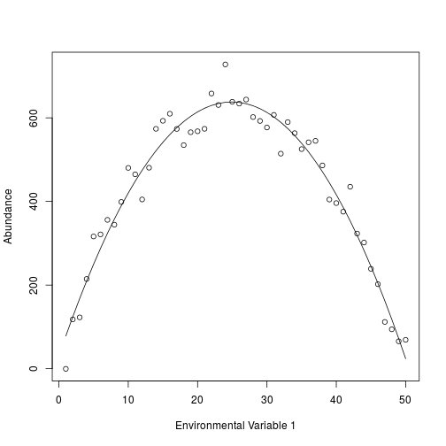
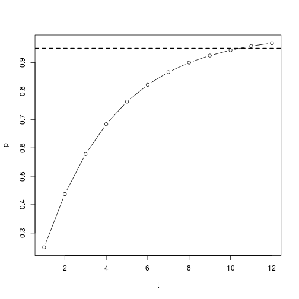

Occupancy Modeling
========================================================
author: Derek Corcoran
date: 2016-03-20
autosize: true

Fitness or abundance patterns
========================================================

- Expensive
- Inexact

***

Imperfect detection
========================================================

Imperfect detection
========================================================

Imperfect detection
========================================================

Two functions
========================================================
 \( p* = 1 -  \left( 1 - p \right)^t \)

 \( \psi = \frac{Sd}{S \times\ p*} \)

***

- Detection probability psi
- Occupancy probability p given prsence
- p* probability to detect at least one time in t surveys
- S number of surveyed sites
- Sd number of sites where species is detected

Two functions
========================================================
 \( p* = 1 -  \left( 1 - p \right)^t \)

 \( \psi = \frac{Sd}{S \times\ p*} \)

***

p = 0.25

\( p* = 1 -  \left( 1 - 0.25 \right)^3 \) = 0.578125

S = 100

Sd = 30

\( \psi = \frac{30}{100 \times\ 0.578*} \) = 0.3047619

Probability of detection
========================================================

